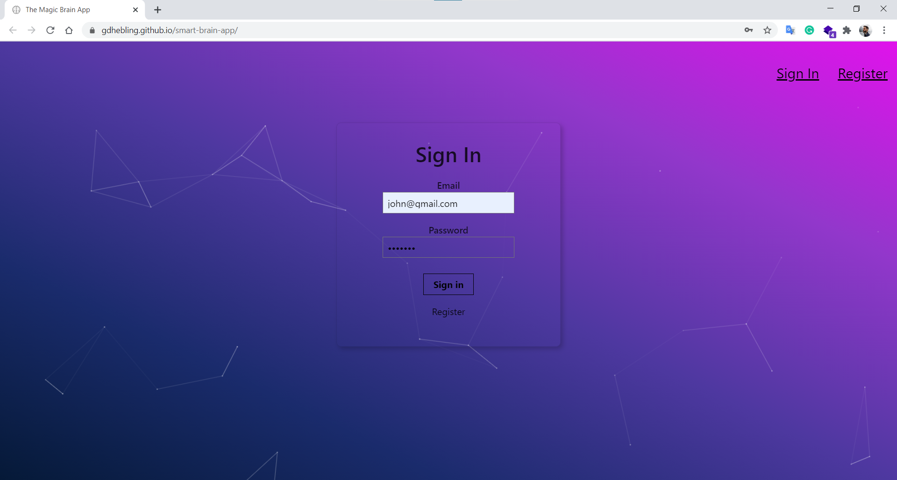

# The Smart Brain React App

## The project

Web application created with **React** and deployed to GitHub Pages using the **CRA** environment.  
The application uses a face-recognition API that detect faces of an inputed image URL.

For now, it is using a locally hosted server created using **Express.js** to log in, register, and counting the entry rank. It uses the CSS framework **Tachyons** for styling.
  

  

#### Demo Video:

## Deployed website

You can find the deployed website at https://gdhebling.github.io/smart-brain-app/

## Process and Next steps

This is a work in progress. Next step is to implement a database.

## That's it!

Thanks for reading! 😀  
I'm Guilherme. Front-End Web Developer.  

