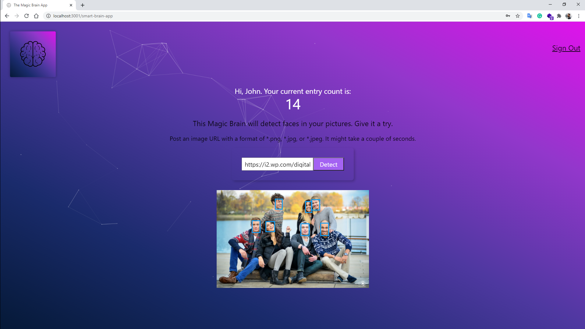

# The Smart Brain React App

## The project
Web application created with **React** and deployed to GitHub Pages using the **CRA** environment.  
The application uses a face-recognition API that detect faces of an inputed image.
  

### Deployed website
You can find the deployed website at https://gdhebling.github.io/smart-brain-app// 

### Process
This is a work in progress.
  

## That's it!
Thanks for reading! 😀  
I'm Guilherme. Front-End Web Developer.  

You can find me on:  

&nbsp;&nbsp;

&nbsp;&nbsp;

